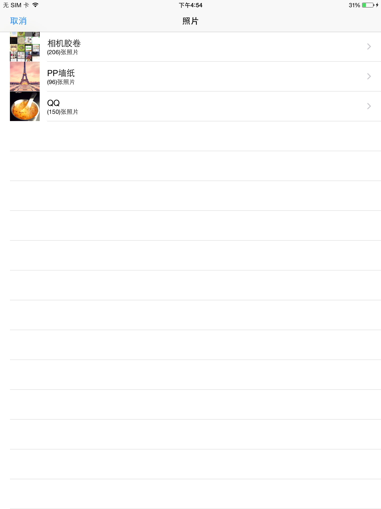
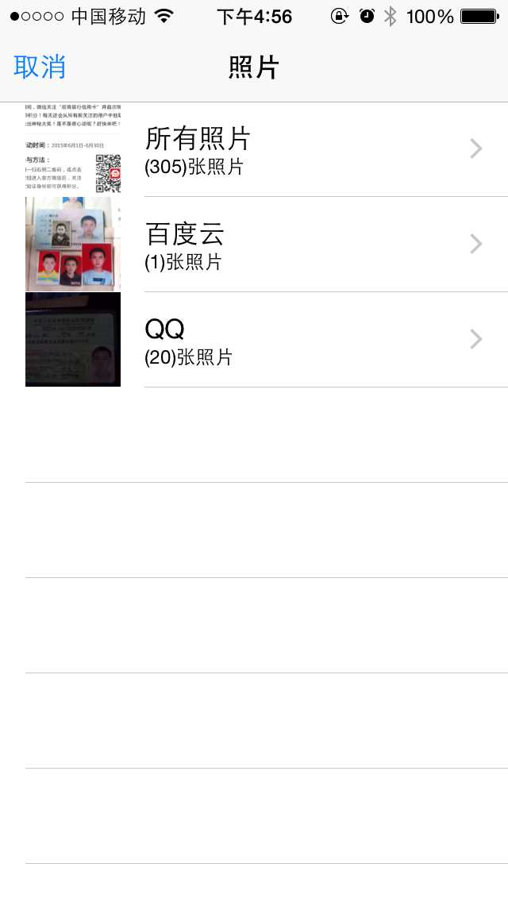

# XXBImagePickerViewController
##初始化跟系统自在的图片选择器一样好用直接push就行 <\br>
*可以对选择的照片进行排序 <\br>
*可以设置右上角的指示数字按钮<\br><\br>
**只需要导入XXBImagePickerController.h
``` OC
- (void)openPhoto
{
    XXBImagePickerController  *imagePickController = [[XXBImagePickerController alloc] init];
    //是否显示右上角的指示数字
    imagePickController.showPage = YES;
    // 设置代理
    imagePickController.imagePickerDelegate = self;
    //设置排序方式
    imagePickController.photoSortType = XXBPhotoSortTypeSystemOrder;
    [self presentViewController:imagePickController animated:YES completion:^{
    
    }];
}
```
##*相关的返回结果在代理里边<\br>
代理方法
``` OC
//取消
- (void)imagePickerControllerCancleselect:(XXBImagePickerController *)imagePickController;
// 确定
- (void)imagePickerController:(XXBImagePickerController *)imagePickController didselectPhotos:(NSArray *)selectPhotos;
```
##*相关属性<\br>
``` OC
//  一行显示的照片个数
//  默认是4个
@property(nonatomic , assign)NSInteger photoInRow;
```
//  如果想在打开的时候原来选中的图片还是选中的话需要设置 selectPhotoALAssets  里边放的是 XXBPhotoAlasetModle 模型 <\br>
原来选中的photo的ALAsset 默认为空<\br>
``` OC
@property(nonatomic , strong)NSMutableArray *selectPhotoALAssets;<\br>
```
#ipaid的效果图<\br>
<\br>
<\br>
#iphone的效果图<\br>
<\br>
<\br>

